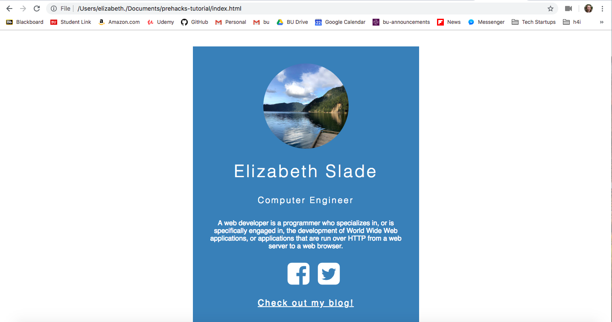

# Pre-Hacks Tutorial with Hack4Impact 
Today you will build your own personal website! We will build the website using HTML and CSS. 

Presentation here: https://docs.google.com/presentation/d/1Lh5aYOGD4tM-amNX-A1jTP95XyxEthio_azAR7QRuqM/edit?usp=sharing

### 1. Download a text editor!
      - Visual Studio Code: https://code.visualstudio.com/
      - Sublime: https://www.sublimetext.com/
      - Atom: https://atom.io/
      
### 2. Click on the green button that says "Clone or Download" and click "Download ZIP"
      - This will download the template that we are going to work on today to build your personal website!
      
      - Wait what's ZIP?
            ZIP is a type of file that compresses folders so it will download quicker
 
### 3. Open your files you downloaded in your text editor!   
      - First open your text editor, and then open the folder (that you downloaded in step 2) 
          in your text editor   
      - Since you downloaded a ZIP file, you may need to extract the folder before 
          opening it with the text editor 
      
      
### 4. Open index.html
      This will be the homepage of your personal website for the demo today. 
      We first want to include the HTML template:
      
      <!DOCTYPE html>
        <html>
          <head>
            <meta charset="UTF-8"/>
            <title></title>
          </head>
          <body>

          </body>
        </html>
 
 ### 5. Let's build!
We want to add this photograph that I took in Seattle to our website!

 
### 6. Personal Website Goal:
This is the general goal for the personal website, but feel free to get creative and have fun! 
 
   
     

 :sun_with_face: **YAAYY Thank you for coming to the Introduction to Programming Workshop!!** :sun_with_face:
